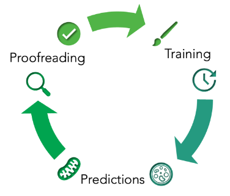
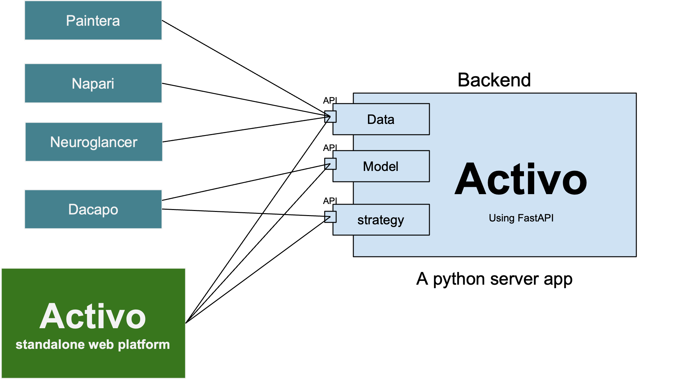

## Active : Backend platform for Active learning
Versioned data is managed using [KLEIO](https://github.com/JaneliaSciComp/KLEIO-Python-SDK)

 Goal:
--
Enable Human in loop machine learning

Architecture:
--
